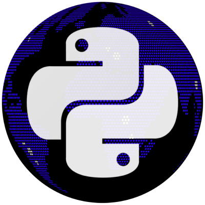

<div align="center" style="display:flex; flex-direction: column; align-items: center">
  
  <h1>UniversalPython</h1>
</div>

<div align="center">
  
  📖 [Documentation](https://universalpython.github.io/) | 🎯 [Examples](./urdupython/samples/) | 📄 [Research Paper](./paper/conference_101719.pdf)


<!-- Available Translations:
[中文说明](./README.cn.md) | [日本語の説明](./README.ja.md) | [한국어 설명](./README.kor.md) | [Français](./README.fr.md) | [Português](./README.ptbr.md) | [Türkçe](./README.tr.md) | [Русский](./README.ru.md) | [Español](./README.es.md) | [Italiano](./README.it.md) -->

</div>

## Features

- **Multilingual Support:** Write code in your native language, be it Urdu, Hindi, Spanish, or any other language with future expansions planned.
- **Seamless Translation:** UniversalPython seamlessly translates your code into standard Python for execution.
- **Familiar Syntax:** Learn programming concepts using natural language analogies, making it easier to grasp core ideas.
- **Leverages Existing Libraries:** Access the vast ecosystem of Python libraries, frameworks, and tools through UniversalPython.
- **Open Source and Extensible:** Contribute to the project and expand support for new languages or improve existing translations.

## Use Cases

* **Reduced Learning Barrier:** No need to master complex English keywords to start coding.
* **Increased Accessibility:** Opens the world of programming to diverse populations who may not be comfortable with English.
* **Faster Development:** Develop applications in your native language at an accelerated pace.
* **Engages New Talent:** Expands the pool of potential programmers by removing the language barrier.
* **Preserves Cultural Identity:** Promotes expression through the language you know best.


## 🚀 Quick Start

### Prerequisites

The only requirement is having [Python 3.4+](https://www.python.org/downloads/) (which includes the default package manager, `pip`).


### Install
If you've installed ```pip```, you can install UniversalPython from [Test PyPI](https://test.pypi.org/project/universalpython/) using the following command:
```
pip install -i urdupython
```

## Learn more
Read up the docs at our [documentation website](https://universalpython.github.io/docs/).

**UniversalPython** is a revolutionary approach to programming languages, aiming to bridge the language gap and empower people of all backgrounds to become programmers. It leverages the power and vast libraries of Python while offering a familiar syntax based on your native language.


## Community & Contribution

We welcome contributions from developers and enthusiasts. 

* **Join the Discussion:** Participate in our [forum](https://discord.gg/xcBpqMDP2E) to share ideas, ask questions, and provide feedback.
* **Contribute to the Project:** Help us expand language support, improve translations, and grow the UniversalPython ecosystem.
* **Found an issue in UniversalPython?** Please use [submit issue](https://github.com/UniversalPython/UniversalPython/issues).

**UniversalPython is still under development, but we believe it has the potential to revolutionize how people learn and create code. Join us on this journey to make programming a truly universal language!**

## License

[Apache-2.0 license](./LICENSE)