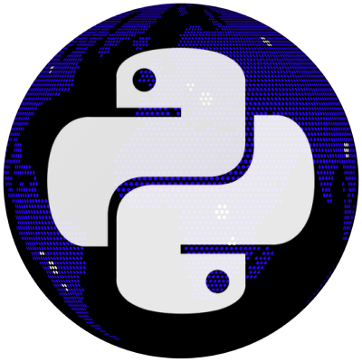
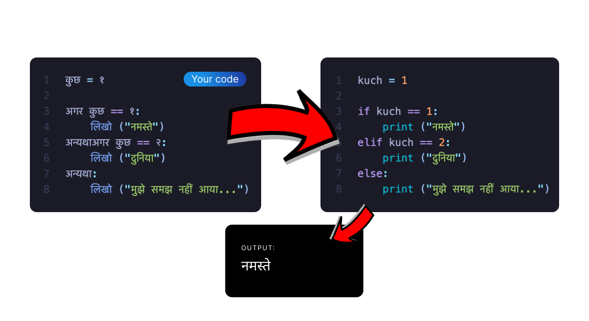

<div align="center">
  
  <h1>UniversalPython</h1>
</div>

<div align="center">
  
📖 [Documentation](https://universalpython.github.io/) | 🎯 [Examples](./test/samples/) | 📄 [Research Paper](./static/paper/conference_101719.pdf) | 🔥 [Live demo (online)](https://universalpython.github.io/playground)

**UniversalPython** is a transpiler that lets you write Python code in your own language. It translates your code into Python while keeping the syntax familiar.

<!-- Available Translations:
[中文说明](./README.cn.md) | [日本語の説明](./README.ja.md) | [한국어 설명](./README.kor.md) | [Français](./README.fr.md) | [Português](./README.ptbr.md) | [Türkçe](./README.tr.md) | [Русский](./README.ru.md) | [Español](./README.es.md) | [Italiano](./README.it.md) -->

</div>



## Features

- **Code in Any Language:** Write code in Urdu, Hindi, Spanish, and more. More languages coming soon!
- **Easy Translation:** Automatically converts your code into Python.
- **Simple Syntax:** Learn programming in your own language with relatable concepts.
- **Access Python Libraries:** Use Python's powerful tools and frameworks.
- **Open Source:** Add new languages or improve translations.

## Why Use UniversalPython?

- **Easier Learning:** No need to know English to code.
- **Cultural Connection:** Code in the language you love.
- **Have fun:** Makes programming available to more people.

## 🚀 Getting Started

### Requirements

You only need [Python 3.4+](https://www.python.org/downloads/).

### Install

Install UniversalPython with pip:

```bash
pip install universalpython
```

See more details about the package on [PyPI](https://pypi.org/project/universalpython/).

### Online Playground

You can also try out UniversalPython in our [live online demo](https://universalpython.github.io/). It runs in your browser.

### UniversalPython in Jupyter
Install our Jupyter Kernel to easily use UniversalPython in Jupyter Notebook or Jupyter Lab. Instructions are here: https://github.com/UniversalPython/universalpython_kernel

### Build and release
Install packaging dependencies:
```bash
python -m pip install --upgrade pip setuptools wheel build twine
```

To build:
```bash
python -m build
```

To release on PyPI:
```bash
twine upload --repository testpypi dist/* --verbose --skip-existing
```

### Learn More

Check out the [documentation](https://universalpython.github.io/docs/intro).

## Join Us!

- **Community Forum:** [Discord](https://discord.gg/xcBpqMDP2E)
- **Contribute:** Help us add languages or improve the project.
- **Report Issues:** [Submit issues](https://github.com/UniversalPython/UniversalPython/issues).

UniversalPython is still growing. Join us to make programming truly universal!

### Want to add your language? Or edit one?
Follow the documentation [here](./universalpython/languages/README.md) to add a new human language, or edit an existing one.

## License

[Apache-2.0 license](./LICENSE)

### Contributors
<a href="https://github.com/UniversalPython/UniversalPython/graphs/contributors">
  
</a>


test